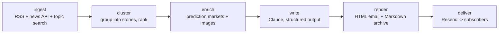

# Priors

**A self-hosted weekly news digest for decision makers. Update your priors, weekly.**

Every Monday morning, Priors emails you a briefing on the last 7 days — politics, markets, science & tech, plus a section tuned to *your* industry. Every story comes with attributed perspectives from real sources and forecasts pulled from prediction markets (Polymarket, Kalshi, Metaculus) — never the LLM's own guesses.

> **Status: Phase 0 (skeleton).** The pipeline runs end-to-end on sample data; live sources, LLM composition, and email delivery land in Phase 1–2. Not ready to fork yet.

*(The name is configurable in `config.yaml`. Alternatives if you prefer: **Basis**, **Delta**, **The Update**, **Signal/Noise**.)*

## What an issue looks like

Each story follows a strict template:

- **Headline** — rewritten, never copied
- **What happened** — 2–4 factual sentences, past 7 days only
- **Why it matters** — second- and third-order implications for a decision maker
- **The takes** — 2–3 distinct perspectives, each attributed and linked to a real source
- **What's next (odds)** — prediction-market probabilities with week-over-week deltas, e.g. *"Polymarket puts a ceasefire by end of September at 34% (↓8pp week-over-week)"*

Plus a 3–5 bullet executive summary up top and a "Markets moved" footer. Past issues live in [`issues/`](issues/) as Markdown.

## Quickstart (15 minutes)

```bash
git clone <this-repo> && cd priors
make setup          # venv + deps + SQLite
make preview        # builds a sample issue -> open build/<week>.html
```

Then personalize:

```bash
cp .env.example .env   # add your API keys (each one documented in the file)
# edit config.yaml — or wait for `priors setup`, the interactive wizard (Phase 3)
```

Run it for real on a small VPS:

```bash
docker compose up -d   # runs the built-in scheduler; default Monday 06:00 in your timezone
```

## Architecture

One container, one SQLite file, six pipeline stages — each runnable and testable on its own:



```bash
priors ingest --sample   # each stage writes a JSON artifact to data/artifacts/
priors cluster
priors enrich --sample
priors write --sample
priors render
priors deliver --dry-run
```

State lives in SQLite: seen articles (cross-week dedup), sent issues, weekly market snapshots (for probability deltas), and subscribers — seeded with one row (you), designed so a future hosted version is a config change, not a rewrite.

## Editorial principles

- Every factual claim links to a source; all links are validated before send.
- Takes are never invented — each is attributed to a real, linked outlet.
- Forecasts come from prediction markets. Where no market exists, the issue says so.
- Tone: dry, precise, lightly witty. No hype words.

## Cost

Target: well under $5/issue with default settings (token usage is logged per run). Expected monthly cost ≈ a few dollars of Claude API + free tiers of GNews and Resend. Full breakdown coming with Phase 1.

## Contributing

See [CONTRIBUTING.md](CONTRIBUTING.md). CI runs lint + tests on every PR.

## License

[MIT](LICENSE)
