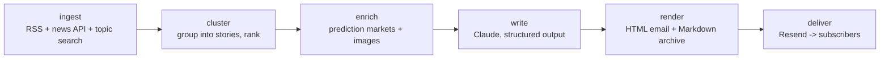

# Priors

**A self-hosted weekly news digest for decision makers. Update your priors, weekly.**

Every Monday morning, Priors emails you a briefing on the last 7 days — politics, markets, science & tech, plus a section tuned to *your* industry. Every story comes with attributed perspectives from real sources and forecasts pulled from prediction markets (Polymarket, Kalshi, Metaculus) — never the LLM's own guesses.

> **Status: Phase 1 (core pipeline).** Live RSS/GNews ingestion, LLM clustering and composition (Claude), link validation, and Resend delivery are implemented. Prediction markets land in Phase 2, the onboarding wizard in Phase 3. Forkable, but rough edges remain.

*(The name is configurable in `config.yaml`. Alternatives if you prefer: **Basis**, **Delta**, **The Update**, **Signal/Noise**.)*

## What an issue looks like

Each story follows a strict template:

- **Headline** — rewritten, never copied
- **What happened** — 2–4 factual sentences, past 7 days only
- **Why it matters** — second- and third-order implications for a decision maker
- **Potential implications** — how a thoughtful reader should update, anchored in prediction-market moves where a matched market exists
- **The takes** — 2–3 distinct perspectives, each attributed and linked to a real source
- **Updating the priors** — prediction-market probabilities with week-over-week deltas, e.g. *"Kalshi puts an 8.0+ earthquake in Japan before 2030 at 45% (↑4pp week-over-week)"* — or an honest "no liquid market covers this yet"

Each issue closes with a "Markets moved" footer, a **Human story of the week**, and a **Photo of the week** (Wikimedia Commons Picture of the Day). Past issues live in [`issues/`](issues/) as Markdown.

## Quickstart (15 minutes)

```bash
git clone https://github.com/patrick-alveos/priors.git && cd priors
make setup          # venv + deps + SQLite
make preview        # builds a sample issue -> open build/<week>.html
```

Then personalize:

```bash
cp .env.example .env   # add your API keys (each one documented in the file)
# edit config.yaml — or wait for `priors setup`, the interactive wizard (Phase 3)
```

Run it for real — two options:

**GitHub Actions (recommended, free for public forks).** Add your API keys as
repository secrets (`Settings → Secrets → Actions`: `ANTHROPIC_API_KEY`,
`RESEND_API_KEY`, and optionally `GNEWS_API_KEY`, `KALSHI_API_KEY_ID`,
`KALSHI_PRIVATE_KEY`). The [`weekly.yml`](.github/workflows/weekly.yml)
workflow builds and sends the issue every Saturday morning, keeps state in the
Actions cache, and commits each issue's Markdown to [`issues/`](issues/).
Trigger it manually anytime from the Actions tab (untick "send" for a dry run).

**Your own machine or VPS:**

```bash
docker compose up -d   # runs the built-in scheduler at the day/time in config.yaml
```

## Architecture

One container, one SQLite file, six pipeline stages — each runnable and testable on its own:



```bash
priors ingest --sample   # each stage writes a JSON artifact to data/artifacts/
priors cluster
priors enrich --sample
priors write --sample
priors render
priors deliver --dry-run
```

State lives in SQLite: seen articles (cross-week dedup), sent issues, weekly market snapshots (for probability deltas), and subscribers — seeded with one row (you), designed so a future hosted version is a config change, not a rewrite.

## Editorial principles

- Every factual claim links to a source; all links are validated before send.
- Takes are never invented — each is attributed to a real, linked outlet.
- Forecasts come from prediction markets. Where no market exists, the issue says so.
- Tone: dry, precise, lightly witty. No hype words.

## Cost

Target: well under $5/issue with default settings. Every run logs token usage and an estimated cost to `data/usage.jsonl` and prints it at the end. Default model is `claude-sonnet-5` (configurable in `config.yaml`); a typical issue is one clustering call + one call per story + one summary call. Expected monthly cost ≈ a few dollars of Claude API + free tiers of GNews and Resend.

## Contributing

See [CONTRIBUTING.md](CONTRIBUTING.md). CI runs lint + tests on every PR.

## License

[MIT](LICENSE)
